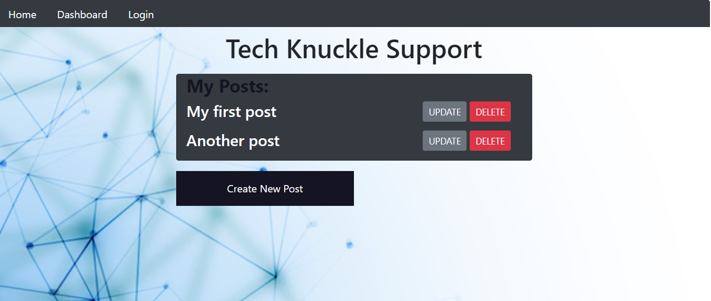
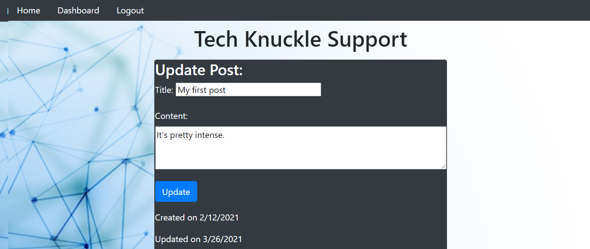

# MVC-Tech-Blog

## Description 

A CMS-style blog site where developers can publish their blog posts and comment on other developers’ posts as well. Utilizes the MVC paradigm as it's architecture, Handlebars.js as the templating language, Sequelize as the ORM, and the express-session npm package for authentication. Users must be logged in to access post create, update and delete features. User will automatically be logged out after 10 minutes. 
Check out the app on Heroku: https://young-temple-65277.herokuapp.com/

## Table of Contents

* [Installation](#installation)
* [Usage](#usage)
* [Credits](#credits)
* [License](#license)
* [Badges](#badges)

## Installation

Update the .env file with your MySql credentials, run 'npm i', 'node seeds/seed.js' then 'node server.js' from the command line to run the server. This app can be used without installation by visiting the Heroku site where it is deployed.

## Usage 

Visit the homepage to view all blog posts. Sign up and log in to create, update and delete your own posts and leave comments on other user's blog posts.

## Credits

Nathan Perfetti  
Blake Dragos  
Michell Brito 

## License

Copyright 2021 Lita Beach

Permission is hereby granted, free of charge, to any person obtaining a copy of this software and associated documentation files (the "Software"), to deal in the Software without restriction, including without limitation the rights to use, copy, modify, merge, publish, distribute, sublicense, and/or sell copies of the Software, and to permit persons to whom the Software is furnished to do so, subject to the following conditions:

The above copyright notice and this permission notice shall be included in all copies or substantial portions of the Software.

THE SOFTWARE IS PROVIDED "AS IS", WITHOUT WARRANTY OF ANY KIND, EXPRESS OR IMPLIED, INCLUDING BUT NOT LIMITED TO THE WARRANTIES OF MERCHANTABILITY, FITNESS FOR A PARTICULAR PURPOSE AND NONINFRINGEMENT. IN NO EVENT SHALL THE AUTHORS OR COPYRIGHT HOLDERS BE LIABLE FOR ANY CLAIM, DAMAGES OR OTHER LIABILITY, WHETHER IN AN ACTION OF CONTRACT, TORT OR OTHERWISE, ARISING FROM, OUT OF OR IN CONNECTION WITH THE SOFTWARE OR THE USE OR OTHER DEALINGS IN THE SOFTWARE.

## Badges

 
 
 
 